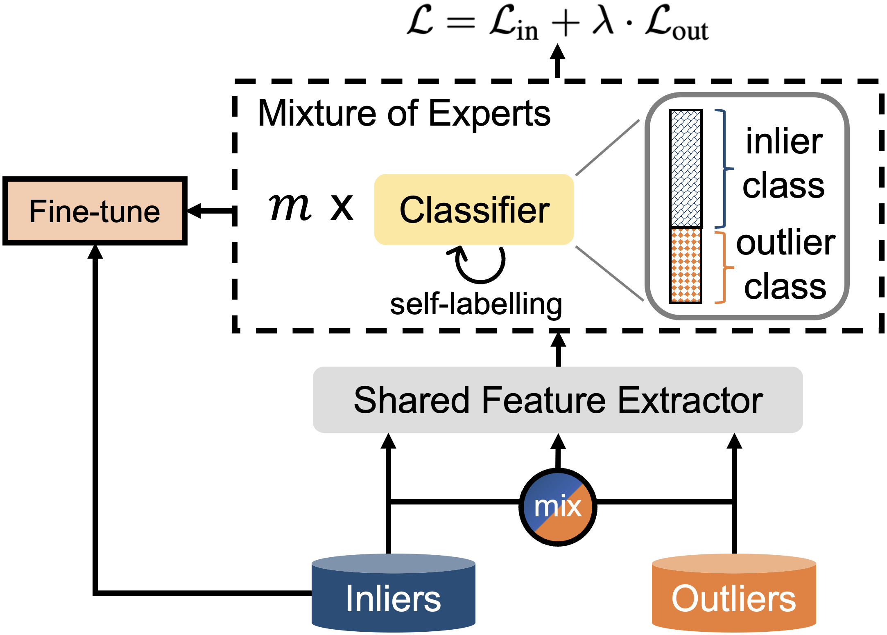

# EAT: Towards Long-Tailed Out-of-Distribution Detection
PyTorch Code for the following paper at AAAI2024 [arXiv](./assets/arxiv.pdf)

<b>Title</b>: <i>Expand and Augment: Towards Long-Tailed Out-of-Distribution Detection</i> 

<b>Abstract</b>
Despite recent promising results on out-of-distribution (OOD) detection, most existing works assume that the in-distribution training dataset is class-balanced, which rarely holds in the wild. In this paper, we study the challenging task of long-tailed OOD detection in which the in-distribution data follows a long-tailed class distribution. The goal is to not only reliably detect OOD data but also achieve high classification accuracy on in-distribution data. We approach these goals by
developing a simple and efficient method: (1) it expands the in-distribution class space with mul-tiple abstention OOD classes to build a detector
with clear decision boundaries; (2) it augments the context-limited tail classes by pasting images onto the context-rich head class and OOD images to improve the generalization. Our method,
EAT (Expand and AugmenT), can displace the outlier exposure method for dealing with long-tailed datasets and can be used as an add-on for existing methods to boost the generalization of
tail classes. Extensive experiments show that EAT outperforms the previous state-of-the-art approach by an average of 2.0% OOD detection AUROC and 2.9% in-distribution classification
accuracy on various benchmark datasets.

<div align="center">
  
</div>


## Stage 1 training: Training the whole model using EAT framework

CIFAR10-LT: 

```
python stage1.py --gpu 0 --epochs 180 --lr 1e-3 --ds cifar10  \
    --Lambda0 0.05 --Lambda1 0.05 --rho 0.01  --md ResNet18  --odc 3 --num_ood_samples 300000 \
	--drp <where_you_store_all_your_datasets> --srp <where_to_save_the_ckpt>
```

CIFAR100-LT:

```
python stage1.py --gpu 0 --epochs 180 --lr 1e-3 --ds cifar100  \
    --Lambda0 0.05 --Lambda1 0.05 --rho 0.01  --md ResNet18  --odc 30 --num_ood_samples 300000 \
	--drp <where_you_store_all_your_datasets> --srp <where_to_save_the_ckpt>
```

ImageNet-LT:

```
python stage1.py --gpu 0 --epochs 100 --ds imagenet  \
    --md ResNet50 -e 60 --opt sgd --decay multisteps --lr 0.1 --wd 5e-5 --tb 100 \
    --ddp --dist_url tcp://localhost:23457 \
    --Lambda0 0.05 --Lambda1 0.05 -momentum 0.9 --odc 30 \
	--drp <where_you_store_all_your_datasets> --srp <where_to_save_the_ckpt>
```


## Stage 2 training: Finetune the classifier

CIFAR10-LT:

```
python stage2.py --gpu 0 --ds cifar10 \
    --odc 3 --epochs 10 --rho 0.01 \
	--drp <where_you_store_all_your_datasets> \
	--pretrained_exp_str <the_name_of_your_stage1_training_experiment>
```

CIFAR100-LT:

```
python stage2.py --gpu 0 --ds cifar100 \
    --odc 30 --epochs 10 --rho 0.01 \
	--drp <where_you_store_all_your_datasets> \
	--pretrained_exp_str <the_name_of_your_stage1_training_experiment>
```

ImageNet-LT:

```
python stage2.py --gpu 1 --ds imagenet -e 1 --opt sgd --decay multisteps --lr 0.01 --wd 5e-5 --tb 100 \
    --ddp --dist_url tcp://localhost:23457 --odc 30 --md ResNet50 --momentum 0 \
	--pretrained_exp_str <the_name_of_your_stage1_training_experiment>
```

`--pretrained_exp_str ` should be something like `e180-b128-adam-lr0.001-wd0.0005-cos_odc3-Lambda00.05-Lambda10.05-tau0`

## Testing

CIFAR10-LT:

```
for dout in texture svhn cifar tin lsun places365
do
python test.py --gpu 0 --ds cifar10 --odc 3 --dout $dout \
	--drp <where_you_store_all_your_datasets> \
	--ckpt_path <where_you_save_the_ckpt>
done
```

CIFAR100-LT:

```
for dout in texture svhn cifar tin lsun places365
do
python test.py --gpu 0 --ds cifar100 --odc 30 --dout $dout \
	--drp <where_you_store_all_your_datasets> \
	--ckpt_path <where_you_save_the_ckpt>
done
```

ImageNet-LT:

```
python test_imagenet.py --gpu 0 --odc 30 \
	--drp <where_you_store_all_your_datasets> \
	--ckpt_path <where_you_save_the_ckpt>
```

## Datasets download

Since our experimental setup refers to previous papers, some relevant datasets such as "tinyimages80m" can be downloaded through this link：
https://github.com/hendrycks/outlier-exposure

See this link to download and process the OOD data set for ImageNet-LT:
https://github.com/amazon-science/long-tailed-ood-detection

## Citation

If you find this repo useful for your work, please cite as:

```bibtex
@article{wei2024EAT,
  title={EAT: Towards Long-Tailed Out-of-Distribution Detection},
  author={Wei, Tong and Wang, Bo-Lin and Zhang, Min-Ling},
  journal={Proceedings of the 38th AAAI Conference on Artificial Intelligence},
  year={2024}
}
```

